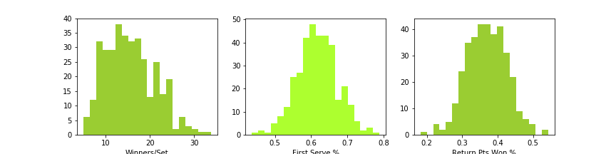
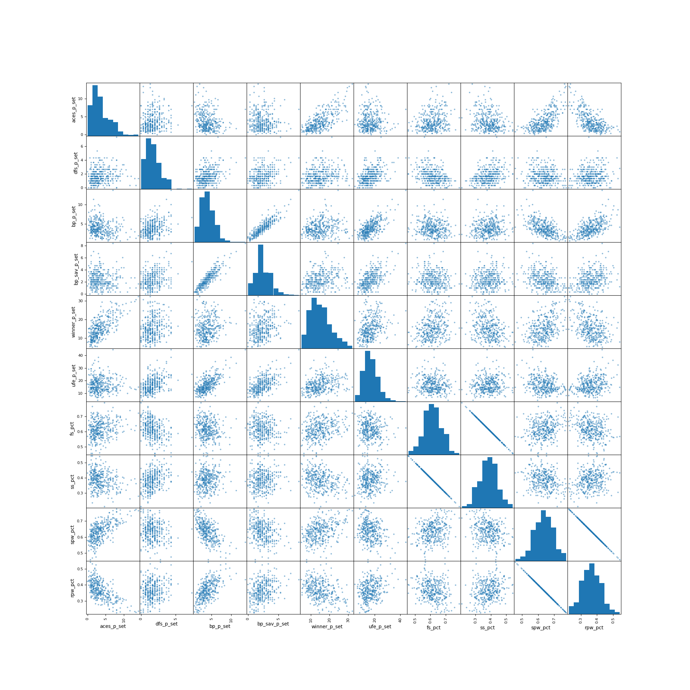

# Predicting Tennis Court Surface (Clay or Not Clay)

##### Table of Contents

1. [Background](#background)
2. [Data](#data)
3. [Project Goal](#project-goal)
4. [EDA](#eda)
    + [Feature Engineering](#feature-engineering)
    + [Feature Selection](#feature-selection)
5. [Model Used](#model-used)
6. [Testing the Model](#testing-the-model-on-unseen-data)
7. [Conclusion](#conclusion)
8. [Areas for Improvement](#areas-for-improvement)

# Background

Professional tennis is generally played on three surfaces: hard court, clay, and grass.
### Clay Courts

Clay courts are made from crushed shale. They are categorized as a slow surface, with higher bounces and high responsiveness to spin.
### Hard Courts

Hard courts are constructed from concrete or asphalt with layers of acrylic paint. They are generally considered a moderate/fast paced surface. The pace of the court can be adjusted based on acrylic paint used.

### Grass Courts

Grass courts are considered to be a fast surface with low, fast bounces.

[*images/info source*](https://www.itftennis.com/technical/facilities/facilities-guide/surface-descriptions.aspx)
# Data

The data used in this the project are from [The Tennis Match Charting Project](https://www.kaggle.com/ryanthomasallen/tennis-match-charting-project). The repository contains .csv files with point-by-point data on ATP and WTP tennis matches. The collection of match data was collected through volunteers charting each point of a match according to the format indicated by the creator of the repository (Jeff Sackman).  

Since the data are created on an open source platform, there are differing levels of competence among the volunteer data collectors (match charters). Not all matches are charted with equal complexity. Some matches have detailed accounts of each point's shot type and direction. However, it is more often the case that the match data contains the basic information on how the point began (first serve in vs. second serve in vs. double fault) and how the point ended (winner vs. unforced error). For this project, I selected features that had the most complete data and chose to exclude features with many missing values.

The dataset I use for analysis contains aggregate point information from 510 ATP matches (men's matches only) from March 2016 through May 2018.

# Project Goal

The goal of this project is to use logistic regression to determine whether or not a match was played on a clay court. In this case, the response variable is the odds that a match was played on clay. The predictor variables are various continuous, normally distributed match analytics which (theoretically) could differentiate a match played on a slow vs. fast surface.

# EDA

I collapsed point data into aggregates for the match. I then merged this aggregate point dataframe with the match dataframe. The final merged dataset had complete information on 510 men's ATP matches. The data set contained with following columns of interest:

'match_id', 'Player 1', 'Player 2', 'Gender', 'Date',  'Surface', 'Best of', 'player', 'aces', 'dfs','first_in', 'first_won', 'second_in', 'second_won', 'bk_pts', 'bp_saved', 'return_pts', 'return_pts_won', 'winners', 'unforced','total_points', 'serve_pts_won'

### Feature Engineering

The data were in raw count format. These counts needed to be standardized because, while most matches are "2-out-of-3" sets, in the biggest tournaments, men play "3-out-of-5" sets. Ace, double fault, break point, winner, and unforced error counts were divided by the number of sets played. For example, winner_p_set was used to indicate the number of winners that were hit per set in a match.

Serve/return statistics were converted to percents of total points. For example fs_pct indicates the percent of the match points which began with a first serve.

Further, 3 dummy variables were created to indicate hard/not hard court, clay/not clay court, grass/not grass court.

### Feature Selection

I believed there would be evidence of aggressive play (more winners, aces, and unforced errors) on the faster surfaces and evidence of more conservative play on slower surfaces (clay). I was most interested in features that would be able to  differentiate matches played on slow vs. fast paced courts based on these metrics of aggressive/conservative play.   

The features I was most interested in were normally distributed with no obvious outliers.

Additionally, I looked through the features for collinearity issues.

The only obvious issues of collinearity are among features that, intuitively, should stick together. For example, % of points that begin with first serves and % of points that begin with second serves should be strongly negatively correlated. Similarly, it makes sense that a positive linear correlation exists between the number of break points played and the number of break points saved.

I chose to include first serve percentage and number of break points played as features in the model because of their potential to account for the importance of the serve in a match. On faster surfaces, an aggressive serve is important as it puts the server on the offensive immediately. On clay, the bounce is slowed so the reward for a "big" serve is mitigated. Theoretically, a more consistent, conservative serve is rewarded on the slower, clay surface.

# Model Used

The initial goal of the project was to be able to predict whether a match was played on hard or clay or grass courts using a multinomial logistic regression. After seeing the balance of the three classes, I narrowed the classes down to clay and not clay. I used the selected features to predict the log odds that a match was played on a clay court.

I ran an initial model on the training data with unbalanced classes,7 features, and a threshold of 0.5.

I narrowed the features down to the five features with significant coefficients.  

Each model was assessed using kfold validation. For each fold, the accuracy, precision, and recall of the model was recorded. The performance of the model was based on the average of these scores across all folds.

The best model used the five features with significant coefficients, balanced classes, and a threshold of 0.5.

The features and coefficients are as follows:

### Odds clay = e-0.72(aces_p_set) e-0.36(dfs_p_set)   e 0.15(winner_p_set)   e 0.78(fs_pct)   e 0.32(rpw_pct)

The model performance on the training data is as follows:

accuracy: 0.69 |
precision: 0.55 |
recall: 0.77

# Testing the Model on Unseen Data

When the model was tested on unseen data, it performed as follows:

test accuracy: 0.68 |
test precision: 0.53 |
test recall:0.69

AUC=0.77

## Conclusion

All in all, the model looks pretty decent! For a small dataset, susceptible to overfitting, the model had pretty good precision and recall on the unseen test data.

Also, 4/5 coefficients make total sense. The features associated with conservative play (high first serve %, return points won) had positive coefficients, indicating that as first serve % and return points won increase, the log odds of the match being on clay also increase.  

The features associated with aggressive play (aces, double faults, winners) were split. Aces and double faults per set had negative coefficients, indicating that as they increase the log odds of a match being on clay decreased. Great!

The coefficient on winners per set was positive, indicating that as the number of winners increases, the log odds of clay increases. This does not hold up with the slow court = conservative play, fast court = aggressive play paradigm I've been working with. However, it is possible, that the winners coefficient is accounting for the higher bounces on a clay court which may allow the ball to sit up longer to be put away for a winner. Just a possibility!   

## Areas for Improvement

1) Include a feature to indicate the length of a point in number of shots per point.

2) Experiment with different thresholds to improve model.

3) Introduce more data to the dataset by also using WTA matches (include a feature for men's vs. women's matches).
